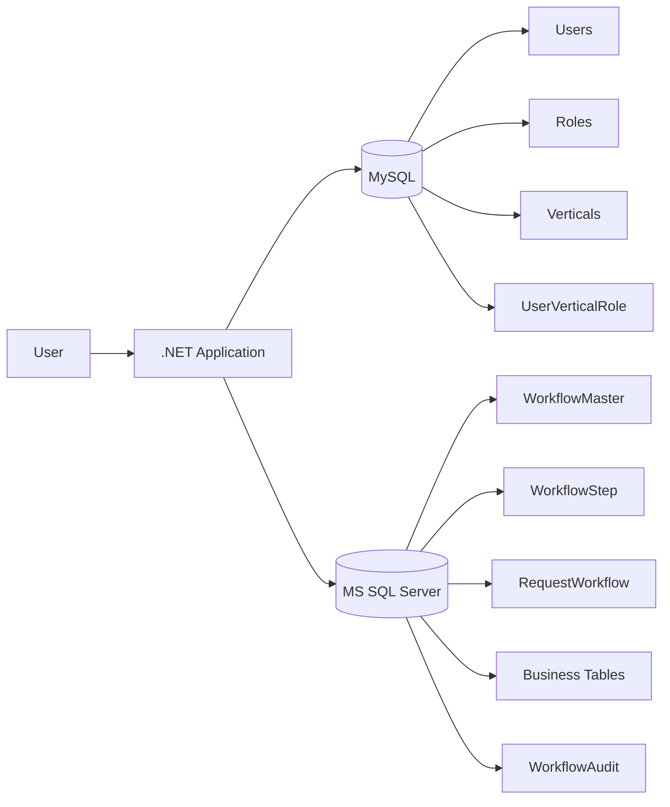
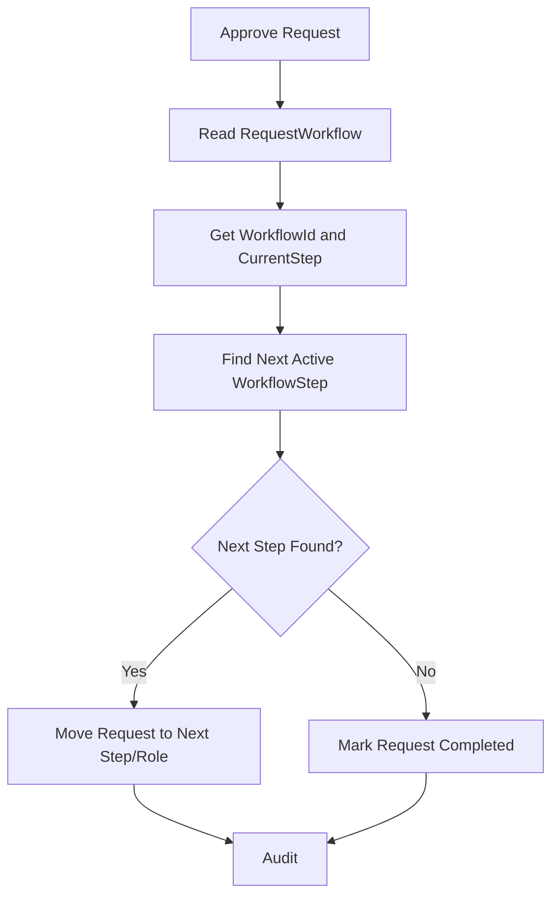
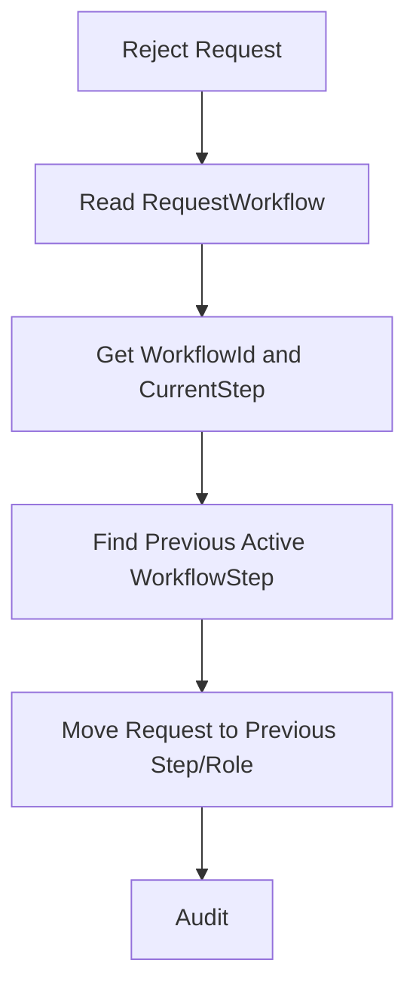
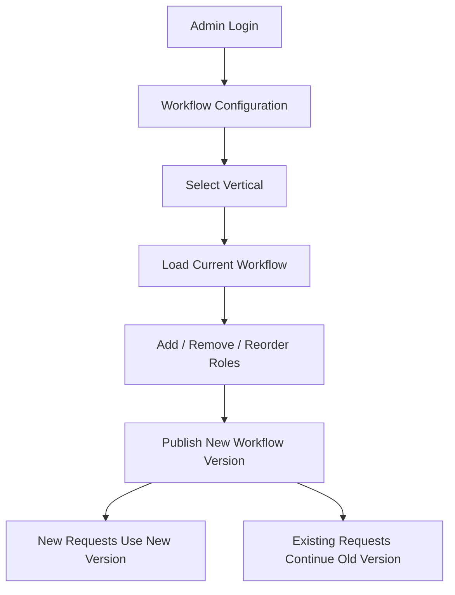

# Dynamic Approval Workflow - Architecture (English)

## Goal

Implement the workflow directly in the existing project using two databases:

- **MySQL**: Users, Roles, Verticals, User-Vertical-Role mapping.
- **MS SQL Server**: Workflow configuration, workflow steps, request state, business processing, audit.

The workflow must be fully data-driven. Role names, role numbers, vertical-specific sequences, and next-role decisions must not be hardcoded in JavaScript, C#, or stored procedures.

## High-Level Architecture



## Vertical-wise Workflow

Each vertical can have a different number of approval steps.

```text
Vertical 1: Maker -> Verifier -> Manager
Vertical 2: Maker -> Verifier -> Auditor -> Manager -> Admin
Vertical 3: Auditor -> Admin
Vertical 4: Maker -> Accountant -> CFO -> Admin
...
Vertical 9: Any configured sequence
```

The same generic engine processes every vertical.

## Approval Processing



## Reject Processing



## Admin-only Configuration

Only Admin can configure workflows.



Security must be enforced in both UI and backend APIs using authenticated roles/claims. Hiding a menu is not sufficient.

## Role Removal Rule

A role should not be physically deleted from an active workflow. First check whether requests are pending on that role. For the first implementation, block removal if pending requests exist. If no pending requests exist, deactivate the workflow step. Later, a controlled migration feature can be added.

## Workflow Versioning

If the workflow changes while requests are already in progress, existing requests must continue on their original workflow version. New requests use the newly published version.

```text
V1: Verifier -> Accountant -> HR
Existing requests continue V1

V2: Verifier -> Manager -> Auditor -> HR
New requests use V2
```

## Stored Procedure Strategy

Keep existing stable pieces such as transaction handling, TRY/CATCH, parameterized dynamic SQL, and business table updates. Replace only the workflow decision logic.

Remove:

- Role-specific CASE statements.
- Hardcoded role names.
- Magic status numbers.
- Hardcoded next-role logic.

Add:

- WorkflowId.
- CurrentStepOrder.
- Dynamic next/previous step lookup.
- Workflow version.
- Generic request status.

## Expected Result

After implementation, adding/removing/reordering roles for any of the nine verticals should require only configuration changes. The main C#, JavaScript, and stored procedure logic should remain unchanged.