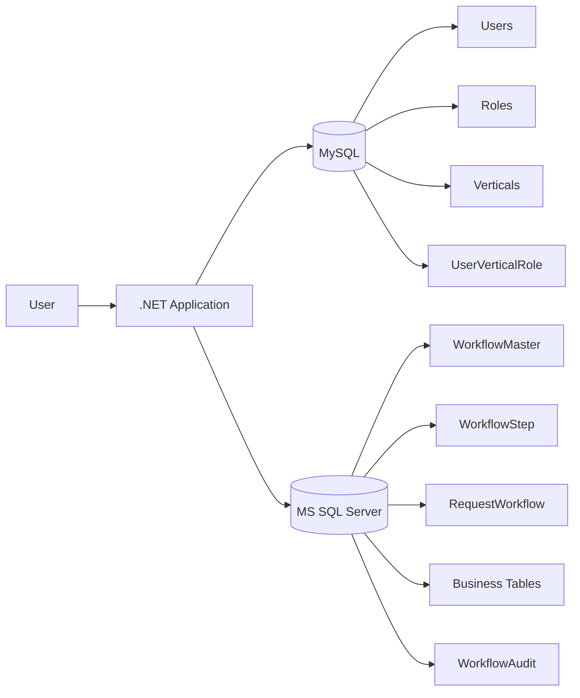
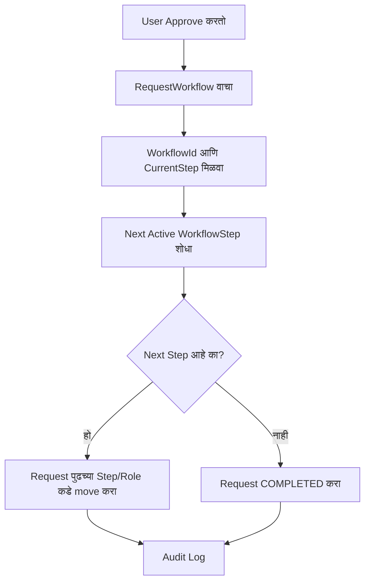
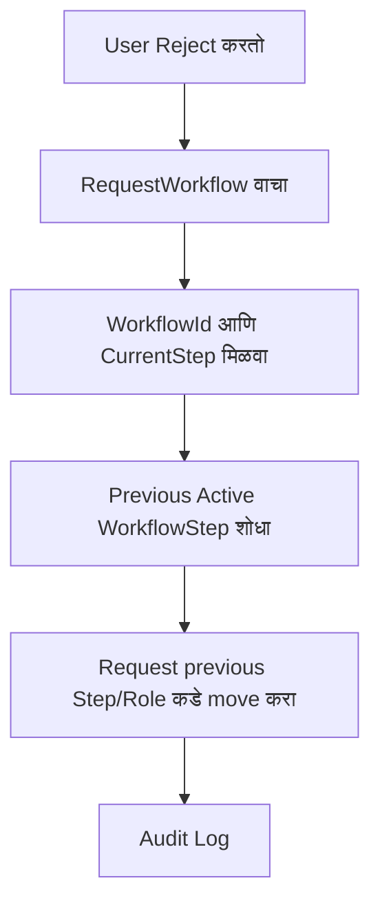
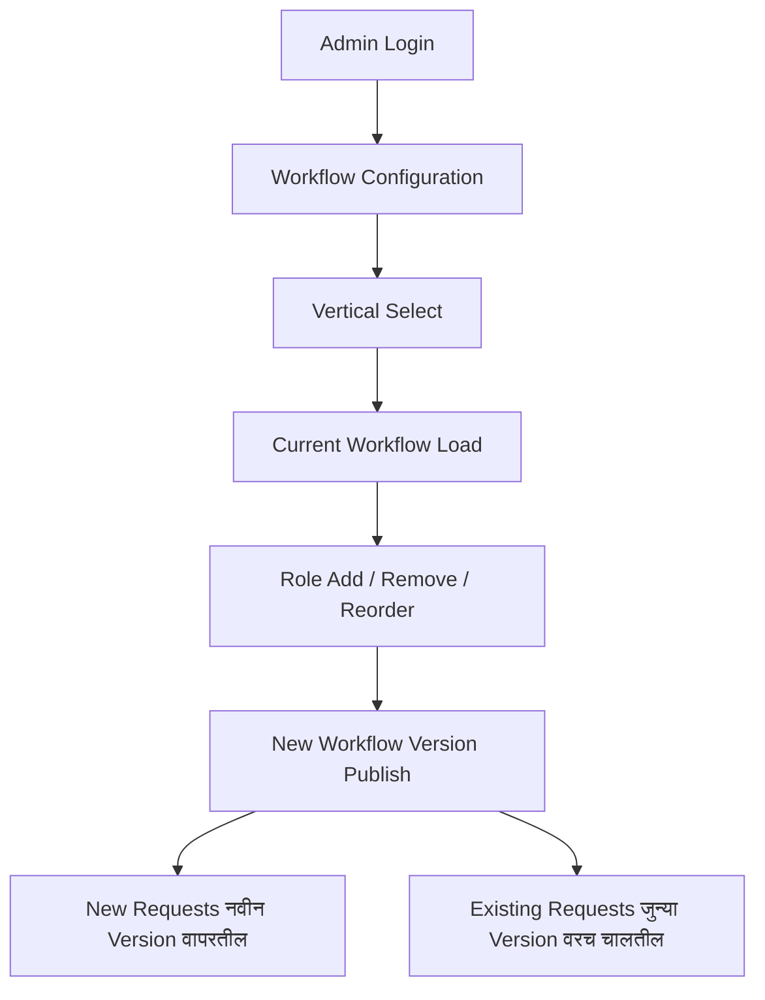

# Dynamic Approval Workflow - Architecture (Marathi)

## उद्देश

हा workflow existing project मध्येच implement करायचा आहे. दोन databases वापरायचे:

- **MySQL**: User, Role, Vertical, User-Vertical-Role mapping.
- **MS SQL Server**: Workflow configuration, workflow steps, request state, business processing आणि audit.

मुख्य उद्देश असा आहे की role name, role number, vertical-wise sequence किंवा next role logic JavaScript, C# किंवा Stored Procedure मध्ये hardcode राहू नये.

## High-Level Architecture



## 9 Verticals साठी स्वतंत्र Workflow

प्रत्येक vertical मध्ये किती roles असतील याची fixed मर्यादा नाही.

```text
Vertical 1: Maker -> Verifier -> Manager
Vertical 2: Maker -> Verifier -> Auditor -> Manager -> Admin
Vertical 3: Auditor -> Admin
Vertical 4: Maker -> Accountant -> CFO -> Admin
...
Vertical 9: Admin ने configure केलेला कोणताही sequence
```

एका vertical मध्ये 2 roles असू शकतात, दुसऱ्यात 3, तिसऱ्यात 5 किंवा जास्त. Main workflow engine मात्र common राहील.

## Approve Flow



Stored Procedure ला पुढचा role Manager आहे, Auditor आहे की Admin आहे हे माहित असण्याची गरज नाही. तो फक्त next configured active step शोधेल.

## Reject Flow



पहिल्या implementation मध्ये reject वर previous active step कडे request पाठवू शकतो.

## Admin-only Configuration

Workflow configuration page फक्त Admin साठी ठेवायची.



फक्त UI वर menu hide करून security complete होत नाही. Backend Controller/API वरही Admin authorization लागेल.

## Role Remove केल्यावर काय करायचे?

Role direct physical delete करू नये.

पहिले check करायचे की त्या role वर pending requests आहेत का.

जर pending requests असतील तर first version मध्ये role removal block करायचा.

जर pending requests नसतील तर त्या workflow step ला `IsActive = 0` करायचे.

नंतर future enhancement म्हणून pending requests दुसऱ्या step कडे migrate करण्याचा option देता येईल.

## Workflow Versioning का आवश्यक आहे?

समजा जुना flow:

```text
V1: Verifier -> Accountant -> HR
```

काही requests आधीच V1 ने process होत आहेत.

Admin flow बदलतो:

```text
V2: Verifier -> Manager -> Auditor -> HR
```

Correct behavior:

```text
Existing/In-Progress Requests -> V1 वरच पूर्ण होतील
New Requests                 -> V2 वापरतील
```

म्हणून running request मध्ये `WorkflowId` आणि `WorkflowVersion` save करणे महत्त्वाचे आहे.

## Stored Procedure मध्ये काय बदलायचे?

पूर्ण SP rewrite करण्याची गरज नाही.

ज्या गोष्टी stable आहेत त्या ठेवू शकतो:

- Transaction handling
- TRY/CATCH
- Parameterized `sp_executesql`
- Trusted table names साठी `QUOTENAME()`
- Existing business table update logic

फक्त workflow decision logic refactor करायची.

काढायचे:

- Role-specific CASE
- Role-specific IF/ELSE
- Hardcoded role numbers
- Magic status values
- Hardcoded next role

Add करायचे:

- WorkflowId
- CurrentStepOrder
- Dynamic next/previous step lookup
- WorkflowVersion
- Generic `PENDING`, `COMPLETED` सारखे statuses

## Parameter Values कुठून येतील?

UI कडून `WorkflowId`, `CurrentStep`, `RoleId` blindly trust करायचे नाहीत.

UI/API मुख्यतः हे पाठवेल:

```text
RequestId
Action
```

SP `RequestWorkflow` मधून बाकीच्या authoritative values घेईल.

यामुळे browser developer tools मधून role किंवा step बदलून unauthorized flow चालवणे कठीण होते.

## Final Result

Implementation नंतर:

```text
Vertical A
Role A -> Role B -> Role C

Vertical B
Role X -> Role Y

Vertical C
Role P -> Role Q -> Role R -> Role S -> Role T

            |
            v
      SAME GENERIC ENGINE
```

Admin database/configuration मधून roles add, remove किंवा reorder करू शकेल. Main C#, JavaScript आणि Stored Procedure प्रत्येक वेळी change करावी लागणार नाही.