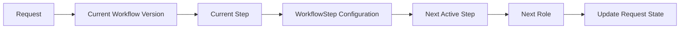
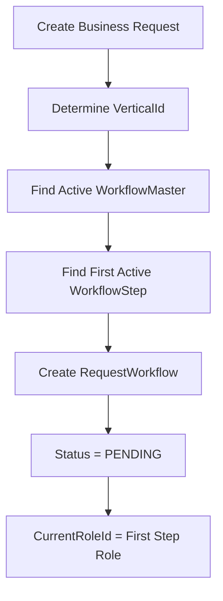
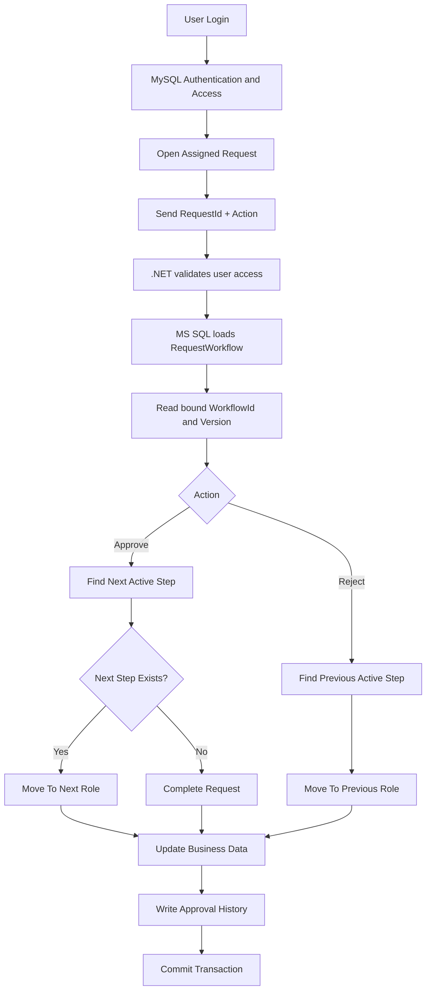
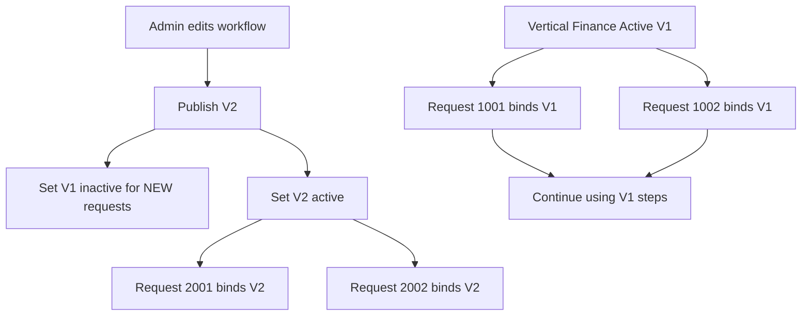

# Dynamic Approval Workflow - Detailed Flow Guide

> Beginner-friendly implementation guide for the existing .NET 8 project.
> Architecture: MySQL for user/access data and MS SQL Server for workflow/business processing.

---

## 1. Purpose

This document explains the full workflow from login to final approval completion.
It is written for a developer who is new to workflow engines.
The goal is to remove hardcoded role names, role numbers, sequence rules, and role-specific status values.
The same generic engine must support every vertical.
One vertical may have 2 roles.
Another vertical may have 3 roles.
Another vertical may have 5 roles.
Another vertical may have 10 roles.
The application code should not change because the number of roles changes.

### Main goals

- Support 9 or more verticals.
- Support any number of roles per vertical.
- Support different sequences per vertical.
- Keep workflow configuration Admin-only.
- Preserve old in-progress requests when configuration changes.
- Use workflow versioning.
- Keep MySQL and MS SQL responsibilities separate.
- Minimize changes to the existing production project.
- Preserve existing stable stored-procedure business logic where possible.

---

## 2. Current Situation

The application currently stores user-related information in MySQL.
Examples are Users, Roles, Verticals, and user access mappings.
Business processing and operational data are stored in MS SQL Server.
The current UI converts role names into fixed numeric values.
The current stored procedure also contains role-specific conditions.

Example of the current anti-pattern:

```javascript
switch (role) {
    case "admin": return "1";
    case "verifier": return "2";
    case "auditor": return "3";
    case "accountant": return "4";
    case "hr": return "5";
}
```

The same type of hardcoding also exists in SQL.
For example, one role may map to status 1.
Another role may map to status 2.
Another role may map to status 3.
This creates a tight dependency between business flow and code.

Problems created by this design:

- Adding a role requires code changes.
- Removing a role can break the flow.
- Reordering roles requires stored procedure changes.
- Different verticals become difficult to manage.
- Magic numbers appear in UI and SQL.
- Existing in-progress requests can become inconsistent after a flow change.

---

## 3. Target Concept

The workflow must be configuration-driven.
The database configuration decides the next step.
The C# code should not decide the next role using role names.
The JavaScript code should not translate roles into static numbers.
The stored procedure should not contain a CASE branch for every role.



### Marathi explanation

Request कुठल्या role कडे पुढे जायचा हे C# किंवा JavaScript ठरवणार नाही.
Database मधील WorkflowStep configuration पुढचा step ठरवेल.
Role चे नाव बदलले तरी flow तुटू नये.
Role ची संख्या वाढली तरी core code बदलू नये.
Sequence बदलला तरी stored procedure पुन्हा rewrite करावा लागू नये.

---

## 4. Two-Database Responsibility

### MySQL responsibility

MySQL should remain the source of truth for identity and access data.
It should contain user-related information.
It should contain role information.
It should contain vertical information.
It should contain user-to-role mapping.
It should contain user-to-vertical mapping.
It can also contain other existing identity/access tables already used by the project.

### MS SQL Server responsibility

MS SQL should contain workflow configuration.
MS SQL should contain workflow versions.
MS SQL should contain workflow steps.
MS SQL should contain current request workflow state.
MS SQL should contain business/lake data.
MS SQL should contain approval history.
MS SQL should contain workflow configuration audit history.

### Important rule

Do not make the design dependent on a fragile direct cross-database join between MySQL and MS SQL.
Use the .NET application/service layer to read identity and access information from MySQL.
Use MS SQL for workflow state and business processing.
This keeps database responsibilities clear.

---

## 5. Vertical-wise Workflow

Each vertical has its own independent workflow.
There is no fixed number of roles.

Example:

```text
Vertical 1 - Loan
Maker -> Verifier -> Manager

Vertical 2 - KYC
Maker -> Verifier -> Auditor -> Manager -> Admin

Vertical 3 - Audit
Auditor -> Admin

Vertical 4 - Finance
Maker -> Accountant -> CFO -> Admin
```

Vertical 1 has 3 steps.
Vertical 2 has 5 steps.
Vertical 3 has 2 steps.
Vertical 4 has 4 steps.
The generic processing engine remains exactly the same.

For 9 verticals, each vertical gets its own active WorkflowMaster version.
Every WorkflowMaster version has its own WorkflowStep rows.
The StepOrder controls the sequence.
The RoleId tells which role owns that step.

---

## 6. Why StepOrder Is Important

StepOrder represents position in a workflow.
StepOrder does not represent a role identity.

Example:

```text
StepOrder 1 -> Maker
StepOrder 2 -> Verifier
StepOrder 3 -> Manager
StepOrder 4 -> Admin
```

Tomorrow Admin may configure:

```text
StepOrder 1 -> Verifier
StepOrder 2 -> Auditor
StepOrder 3 -> CFO
StepOrder 4 -> Admin
```

The stored procedure still only searches for the next StepOrder.
It does not need a new IF condition for Auditor.
It does not need a new IF condition for CFO.
It does not need to know that Admin is the last role.
The last step is detected because no next active step exists.

---

## 7. WorkflowMaster Table

WorkflowMaster represents one published version of a workflow for one vertical.

```sql
CREATE TABLE WorkflowMaster
(
    WorkflowId INT IDENTITY(1,1) PRIMARY KEY,
    VerticalId INT NOT NULL,
    VersionNo INT NOT NULL,
    IsActive BIT NOT NULL DEFAULT 1,
    CreatedBy BIGINT NOT NULL,
    CreatedOn DATETIME2 NOT NULL DEFAULT SYSDATETIME(),
    PublishedOn DATETIME2 NULL
);
```

Recommended unique index:

```sql
CREATE UNIQUE INDEX UX_WorkflowMaster_Vertical_Version
ON WorkflowMaster(VerticalId, VersionNo);
```

For new requests, normally only one version should be active for a vertical.
Old versions must stay in the table.
Old versions must not be deleted if requests or audit history refer to them.

---

## 8. WorkflowStep Table

WorkflowStep stores ordered roles for a specific workflow version.

```sql
CREATE TABLE WorkflowStep
(
    WorkflowStepId INT IDENTITY(1,1) PRIMARY KEY,
    WorkflowId INT NOT NULL,
    RoleId INT NOT NULL,
    StepOrder INT NOT NULL,
    IsActive BIT NOT NULL DEFAULT 1,

    CONSTRAINT FK_WorkflowStep_WorkflowMaster
        FOREIGN KEY (WorkflowId)
        REFERENCES WorkflowMaster(WorkflowId),

    CONSTRAINT UQ_WorkflowStep_Order
        UNIQUE (WorkflowId, StepOrder)
);
```

RoleId comes from the stable role identity used by the access system.
Do not infer RoleId from RoleName.
Do not assume RoleId 2 is always Verifier.
Do not assume RoleId 5 is always HR.
The workflow should only care about the configured RoleId.

---

## 9. RequestWorkflow Table

Every request must remember which workflow version it started with.
This is the most important part of safe versioning.

```sql
CREATE TABLE RequestWorkflow
(
    RequestWorkflowId BIGINT IDENTITY(1,1) PRIMARY KEY,
    RequestId BIGINT NOT NULL,
    VerticalId INT NOT NULL,
    WorkflowId INT NOT NULL,
    WorkflowVersion INT NOT NULL,
    CurrentStepOrder INT NOT NULL,
    CurrentRoleId INT NOT NULL,
    Status VARCHAR(30) NOT NULL,
    CreatedOn DATETIME2 NOT NULL DEFAULT SYSDATETIME(),
    UpdatedOn DATETIME2 NULL
);
```

Recommended statuses:

```text
PENDING
COMPLETED
CANCELLED
REJECTED_FINAL
```

Use REJECTED_FINAL only if the business has a final reject state.
Do not use role-specific status numbers.
CurrentStepOrder + CurrentRoleId + Status already describe the request state.

---

## 10. Request Creation Flow

When a new business request is created, first determine its VerticalId.
Then find the active WorkflowMaster for that vertical.
Then find the first active WorkflowStep.
Then create RequestWorkflow and permanently bind the request to that WorkflowId/version.



Example query for active workflow:

```sql
SELECT TOP 1
    @WorkflowId = WorkflowId,
    @WorkflowVersion = VersionNo
FROM WorkflowMaster
WHERE VerticalId = @VerticalId
  AND IsActive = 1
ORDER BY VersionNo DESC;
```

Example query for first step:

```sql
SELECT TOP 1
    @CurrentStepOrder = StepOrder,
    @CurrentRoleId = RoleId
FROM WorkflowStep
WHERE WorkflowId = @WorkflowId
  AND IsActive = 1
ORDER BY StepOrder ASC;
```

If no active workflow exists for that vertical, do not create a broken RequestWorkflow row.
Return a clear configuration error.
If workflow exists but has no active steps, also return a clear configuration error.

---

## 11. Where Stored Procedure Values Come From

The browser should not be trusted for workflow state.
The browser should not send authoritative WorkflowId.
The browser should not send authoritative CurrentStepOrder.
The browser should not send authoritative CurrentRoleId.
The browser should not decide NextRoleId.

The UI/API should mainly send:

```text
RequestId
Action
Remarks (optional)
```

The stored procedure loads authoritative values from RequestWorkflow.

```sql
SELECT
    @WorkflowId = WorkflowId,
    @CurrentStepOrder = CurrentStepOrder,
    @CurrentRoleId = CurrentRoleId,
    @VerticalId = VerticalId
FROM RequestWorkflow
WHERE RequestId = @RequestId;
```

### Marathi explanation

@WorkflowId आणि @CurrentStepOrder UI मधून बनवून पाठवायचे नाहीत.
RequestId च्या आधारे database मधून काढायचे.
यामुळे browser DevTools मधून roleId किंवा step बदलून unauthorized flow manipulate करणे कठीण होते.

---

## 12. Approve Flow

Approve means move to the next active configured step.

```sql
SELECT TOP 1
    @NextStepOrder = StepOrder,
    @NextRoleId = RoleId
FROM WorkflowStep
WHERE WorkflowId = @WorkflowId
  AND StepOrder > @CurrentStepOrder
  AND IsActive = 1
ORDER BY StepOrder ASC;
```

If next step exists:

```sql
UPDATE RequestWorkflow
SET CurrentStepOrder = @NextStepOrder,
    CurrentRoleId = @NextRoleId,
    Status = 'PENDING',
    UpdatedOn = SYSDATETIME()
WHERE RequestId = @RequestId;
```

If no next step exists, current step is the final step.

```sql
UPDATE RequestWorkflow
SET Status = 'COMPLETED',
    UpdatedOn = SYSDATETIME()
WHERE RequestId = @RequestId;
```

This is why we do not need to hardcode that HR or Admin is the last role.
The configuration itself defines which step is last.

---

## 13. Approve Example

Configured workflow:

```text
1 Maker
2 Verifier
3 Manager
4 HR
```

Current request:

```text
WorkflowId = 100
CurrentStepOrder = 2
CurrentRoleId = Verifier
Status = PENDING
```

Approve query searches for:

```text
StepOrder > 2
ORDER BY StepOrder ASC
TOP 1
```

Result:

```text
StepOrder = 3
Role = Manager
```

The system moves the request to Manager.
No role-specific logic is needed.

---

## 14. Reject Flow

For the first implementation, Reject can return to the previous active step.

```sql
SELECT TOP 1
    @PreviousStepOrder = StepOrder,
    @PreviousRoleId = RoleId
FROM WorkflowStep
WHERE WorkflowId = @WorkflowId
  AND StepOrder < @CurrentStepOrder
  AND IsActive = 1
ORDER BY StepOrder DESC;
```

Example:

```text
1 Maker
2 Verifier
3 Auditor
4 Manager
```

If Manager rejects, previous active step is Auditor.
If Auditor were inactive inside that same version, the query would find Verifier.
For versioned published workflows, it is better not to modify old versions unnecessarily.

If future business rules require Manager Reject to jump directly to Maker, add configurable transition rules.
Do not hardcode Manager -> Maker in code.

---

## 15. Role Removal

Role removal must be safe.
Do not physically delete historical workflow steps.
Prefer publishing a new workflow version without that role.

Before removing a role from a currently edited configuration, check pending requests if the business wants to alter the active version directly.

```sql
SELECT COUNT(*) AS PendingCount
FROM RequestWorkflow
WHERE CurrentRoleId = @RoleId
  AND Status = 'PENDING';
```

Safe initial rule:

- If PendingCount > 0, block destructive removal from a workflow version already used by requests.
- Tell Admin that pending requests exist.
- Do not silently move those records.
- Publish a new version for future requests.

Best versioned approach:

Old version keeps the role.
New version is created without the role.
Old requests continue their old flow.
New requests use the new flow.

---

## 16. Workflow Versioning - Beginner Explanation

Workflow versioning means keeping old and new copies of the approval configuration.
It protects requests that are already in progress.

Imagine this current flow:

```text
Version 1
Verifier -> Accountant -> HR
```

100 requests start on Version 1.
50 requests have already reached Accountant.
The Admin now wants this new flow:

```text
Version 2
Verifier -> Manager -> Auditor -> HR
```

If we overwrite Version 1 rows, the 50 requests at Accountant become dangerous.
Accountant does not even exist in Version 2.
The application may not know where those requests should go next.
That is why Version 1 must not be overwritten.

Correct rule:

```text
Existing requests -> stay on Version 1
New requests      -> start on Version 2
```

This is the core idea of workflow versioning.

---

## 17. Versioning Example With Actual Data

Before change:

```text
WorkflowMaster

WorkflowId | VerticalId | VersionNo | IsActive
------------------------------------------------
101        | 4          | 1         | 1
```

WorkflowId 101 steps:

```text
1 Verifier
2 Accountant
3 HR
```

Request 5001 starts using Version 1:

```text
RequestId = 5001
WorkflowId = 101
WorkflowVersion = 1
CurrentStepOrder = 2
CurrentRoleId = Accountant
Status = PENDING
```

Admin publishes a new configuration.
Do not update WorkflowId 101 steps.
Create a new WorkflowMaster row.

```text
WorkflowId | VerticalId | VersionNo | IsActive
------------------------------------------------
101        | 4          | 1         | 0
102        | 4          | 2         | 1
```

WorkflowId 102 steps:

```text
1 Verifier
2 Manager
3 Auditor
4 HR
```

Request 5001 still stores WorkflowId 101.
Therefore Request 5001 continues Version 1.
A new Request 6001 stores WorkflowId 102.
Therefore Request 6001 follows Version 2.

---

## 18. Meaning of IsActive in Versioning

This point is very important.

When Version 1 is changed to IsActive = 0, it should mean:

```text
Do not assign Version 1 to NEW requests.
```

It should NOT mean:

```text
Existing Version 1 requests cannot use it anymore.
```

Existing requests already store WorkflowId 101.
When they approve or reject, the SP uses WorkflowId 101.
Therefore old WorkflowStep rows must still exist.

Old workflow versions are inactive only for new assignment.
They are still valid historical process definitions.

---

## 19. Publishing a New Version

Recommended publish sequence:

1. Admin logs in.
2. Admin opens Workflow Configuration.
3. Admin selects one vertical.
4. Application loads the current active workflow version.
5. Application displays ordered roles.
6. Admin adds, removes, or reorders roles.
7. Admin clicks Publish.
8. Backend verifies Admin authorization.
9. Backend validates VerticalId.
10. Backend validates every RoleId.
11. Backend validates StepOrder values.
12. Backend ensures at least one workflow step exists.
13. Backend begins an MS SQL transaction.
14. Backend loads the current active WorkflowMaster.
15. Backend calculates NewVersion = CurrentVersion + 1.
16. Backend inserts a new WorkflowMaster row.
17. Backend inserts all new WorkflowStep rows.
18. Backend marks the old version inactive for new requests.
19. Backend keeps the old WorkflowStep rows unchanged.
20. Backend writes WorkflowAudit.
21. Backend commits the transaction.

If any step fails, rollback.
A partially published workflow must not remain in the database.

---

## 20. Publish Transaction Concept

```sql
BEGIN TRY
    BEGIN TRAN;

    SELECT @OldWorkflowId = WorkflowId,
           @OldVersion = VersionNo
    FROM WorkflowMaster WITH (UPDLOCK, HOLDLOCK)
    WHERE VerticalId = @VerticalId
      AND IsActive = 1;

    SET @NewVersion = ISNULL(@OldVersion, 0) + 1;

    INSERT INTO WorkflowMaster
        (VerticalId, VersionNo, IsActive, CreatedBy, PublishedOn)
    VALUES
        (@VerticalId, @NewVersion, 1, @AdminUserId, SYSDATETIME());

    SET @NewWorkflowId = SCOPE_IDENTITY();

    -- Insert the validated new WorkflowStep rows here.

    UPDATE WorkflowMaster
    SET IsActive = 0
    WHERE WorkflowId = @OldWorkflowId;

    -- Keep @NewWorkflowId active.

    -- Insert WorkflowAudit here.

    COMMIT TRAN;
END TRY
BEGIN CATCH
    IF @@TRANCOUNT > 0
        ROLLBACK TRAN;

    THROW;
END CATCH;
```

The exact locking strategy must be tested with the existing project workload.
The important concept is that publishing must be atomic.

---

## 21. What Happens When Flow Changes Halfway

Scenario:

```text
Version 1
Maker -> Verifier -> Accountant -> HR
```

Request A is currently at Accountant.
Request B is currently at Verifier.
Admin publishes:

```text
Version 2
Maker -> Manager -> Auditor -> HR
```

Correct result:

```text
Request A -> continues V1 -> HR
Request B -> continues V1 -> Accountant -> HR
New Request C -> starts V2 -> Maker -> Manager -> Auditor -> HR
```

Old requests do not automatically jump to Version 2.
That would change their business process halfway through.

---

## 22. What If Half the Data Is Already Processed

Suppose 1,000 records entered Version 1.
500 records are already processed to Step 2 or Step 3.
500 records are still at Step 1.
Admin now publishes Version 2.

Do not divide those 1,000 records based on current step.
All 1,000 records already belong to Version 1.
They should continue Version 1 unless an explicit migration is approved.
Only requests created after Version 2 becomes active should use Version 2.

This keeps the rule simple and auditable.

---

## 23. Optional Migration of Existing Requests

Migration is different from publishing a new version.
Do not automatically migrate existing requests.

Why?

Suppose old current step is Accountant.
The new flow contains Manager and Auditor.
The system cannot safely guess which new step is equivalent to Accountant.
The answer is a business decision.

Possible future Admin UI:

```text
Old Step: Accountant
Map To New Step: [Manager v]
Pending Requests: 42
[Migrate Pending Requests]
```

Migration must:

- Require Admin authorization.
- Show pending request count.
- Require explicit old-step to new-step mapping.
- Run in a transaction.
- Write audit history.
- Never change completed approval history.
- Store source and destination workflow versions.

For the first implementation, migration can be excluded.
Let old requests finish old versions.
This is simpler and safer.

---

## 24. Admin-only Configuration

Only Admin should access configuration initially.
A future enhancement can introduce a dedicated WorkflowAdmin permission.

UI protection:

```cshtml
@if (User.IsInRole("Admin"))
{
    <a asp-controller="WorkflowConfiguration"
       asp-action="Index">
        Workflow Configuration
    </a>
}
```

Backend protection:

```csharp
[Authorize(Roles = "Admin")]
public class WorkflowConfigurationController : Controller
{
    public IActionResult Index()
    {
        return View();
    }
}
```

Every save/publish endpoint must also have authorization.
Hiding the menu is not enough.
A normal user can manually call a URL.
The server must return 403 Forbidden for unauthorized configuration access.

---

## 25. Workflow Configuration UI

Recommended first UI:

```text
Vertical: [Finance v]
Active Version: V3

Step 1  [Maker]
Step 2  [Verifier]
Step 3  [Manager]
Step 4  [HR]

[Add Role]
[Move Up]
[Move Down]
[Remove]
[Publish New Version]
```

For the first version, Move Up and Move Down buttons are easier to implement safely than drag-and-drop.
Drag-and-drop can be added later.

Admin should be able to configure all 9 verticals independently.
Changing Finance should not affect KYC.
Changing KYC should not affect Audit.
Every vertical maintains its own version sequence.

---

## 26. UI Validation

Before publishing:

- Vertical must be selected.
- At least one step must exist.
- Every selected RoleId must be valid.
- Disabled roles should not be added to new versions.
- StepOrder should be sequential.
- Duplicate StepOrder must not exist.
- Duplicate RoleId behavior should match business rules.
- Admin should confirm the publish action.

UI validation improves usability.
Backend validation is still mandatory.

---

## 27. Backend Validation

Backend must repeat important validation.
Never rely only on JavaScript.

Validate:

- Authenticated user is Admin.
- Vertical exists.
- Vertical is active.
- Role IDs exist.
- Roles are active.
- At least one step exists.
- StepOrder is valid.
- Payload does not contain duplicate step positions.
- Active workflow version is re-read when publishing.

If Admin opened V3 but another Admin already published V4, detect that conflict.
Do not accidentally create an invalid sequence from stale data.

---

## 28. User Approval Authorization

A user should not approve a request just because they know RequestId.

Before processing:

1. Read RequestWorkflow.
2. Read VerticalId.
3. Read CurrentRoleId.
4. Read authenticated UserId.
5. Check the user access mapping in MySQL.
6. Confirm the user has CurrentRoleId for that VerticalId.
7. Only then process Approve or Reject.

### Marathi explanation

Browser मधून roleId=Admin पाठवला म्हणून user Admin होत नाही.
Server-side user-role-vertical mapping validate करणे आवश्यक आहे.
Client payload वर authorization ठेवू नये.

---

## 29. Approval History

Every transition should be logged.

Suggested table:

```sql
CREATE TABLE ApprovalHistory
(
    ApprovalHistoryId BIGINT IDENTITY(1,1) PRIMARY KEY,
    RequestId BIGINT NOT NULL,
    WorkflowId INT NOT NULL,
    WorkflowVersion INT NOT NULL,
    FromStepOrder INT NULL,
    ToStepOrder INT NULL,
    FromRoleId INT NULL,
    ToRoleId INT NULL,
    Action VARCHAR(30) NOT NULL,
    PerformedBy BIGINT NOT NULL,
    Remarks NVARCHAR(1000) NULL,
    PerformedOn DATETIME2 NOT NULL DEFAULT SYSDATETIME()
);
```

Examples of Action:

```text
CREATED
APPROVED
REJECTED
COMPLETED
MIGRATED
CANCELLED
```

Never rewrite historical ApprovalHistory when a workflow version changes.

---

## 30. Workflow Configuration Audit

Workflow configuration changes need a separate audit trail.

Track:

- VerticalId.
- OldWorkflowId.
- NewWorkflowId.
- OldVersion.
- NewVersion.
- ChangedBy.
- ChangedOn.
- Change summary.

This helps answer:

- Who changed the Finance workflow?
- When was Auditor added?
- When was Manager removed?
- Which version became active?

---

## 31. Stored Procedure Refactoring Strategy

Do not immediately rewrite the entire stored procedure.
Preserve stable existing logic.

Likely keep:

- TRY/CATCH.
- BEGIN TRAN / COMMIT / ROLLBACK.
- Parameterized sp_executesql.
- QUOTENAME for validated dynamic table names.
- Existing table iteration logic if genuinely needed.
- Existing business data updates.

Replace:

- Role-name CASE blocks.
- Role-name IF/ELSE blocks.
- Hardcoded numeric status transitions.
- Hardcoded next-role calculations.

The risky workflow-decision section becomes generic.

---

## 32. Generic Stored Procedure Inputs

Prefer inputs such as:

```text
@RequestId
@Action
@PerformedBy
@Remarks
```

Do not require the caller to provide authoritative values like:

```text
@WorkflowId
@CurrentStepOrder
@CurrentRoleId
@NextRoleId
```

Those values should come from RequestWorkflow and WorkflowStep.

---

## 33. Processing Transaction

Approval should be atomic.

Conceptual transaction:

```text
BEGIN TRANSACTION
  -> Read/lock RequestWorkflow
  -> Validate Status = PENDING
  -> Validate current user access
  -> Resolve next/previous step
  -> Update business table(s)
  -> Update RequestWorkflow
  -> Insert ApprovalHistory
COMMIT
```

If any operation fails:

```text
ROLLBACK
```

This prevents business data and workflow state from getting out of sync.

---

## 34. Concurrency Problem

Two users should not approve the same request at the same time.

Example problem:

```text
User A reads Step 2 PENDING
User B reads Step 2 PENDING
User A approves successfully
User B still tries to approve old Step 2 state
```

The second operation should fail or reload current state.

Possible optimistic check:

```sql
UPDATE RequestWorkflow
SET CurrentStepOrder = @NextStepOrder,
    CurrentRoleId = @NextRoleId,
    UpdatedOn = SYSDATETIME()
WHERE RequestId = @RequestId
  AND CurrentStepOrder = @ExpectedCurrentStep
  AND Status = 'PENDING';

IF @@ROWCOUNT = 0
BEGIN
    THROW 50010, 'Request state changed. Reload and try again.', 1;
END
```

Adapt this to the current project before production use.

---

## 35. Error Handling

Use clear errors.

Examples:

- Workflow not configured for vertical.
- Workflow has no active steps.
- Request not found.
- Request already completed.
- Request state changed.
- User is not authorized for the current step.
- Role cannot be removed because pending requests exist.
- Workflow configuration changed while Admin was editing.

Use TRY/CATCH around transaction logic.
Use THROW when compatible with the existing SQL Server code style.

---

## 36. First Implementation Scope

Phase 1 should support:

- Dynamic roles.
- Dynamic StepOrder.
- 9 verticals.
- Different role counts per vertical.
- Approve to next step.
- Reject to previous step.
- Workflow versioning.
- Admin-only configuration.
- Role-removal safety.
- Approval history.
- Workflow configuration audit.

Phase 1 does not need:

- Parallel approvals.
- Conditional branches based on amount.
- SLA escalation.
- Auto-reassignment.
- Advanced migration UI.
- Complex BPMN engine features.

Keep the first implementation understandable and testable.

---

## 37. Test: Vertical With 2 Roles

Configuration:

```text
Step 1 -> Checker
Step 2 -> Manager
```

Test:

1. Create request.
2. Verify CurrentRole = Checker.
3. Checker approves.
4. Verify CurrentRole = Manager.
5. Manager approves.
6. Verify Status = COMPLETED.
7. Verify ApprovalHistory contains all transitions.

---

## 38. Test: Vertical With 3 Roles

Configuration:

```text
Maker -> Verifier -> Admin
```

Test full approve flow.
Test reject from Admin to Verifier.
Test reject from Verifier to Maker.
Confirm history rows are correct.
Confirm no code change was required compared with the 2-role workflow.

---

## 39. Test: Vertical With 5 Roles

Configuration:

```text
Maker -> Checker -> Verifier -> Manager -> Admin
```

Test all five steps.
Confirm the same generic SP works.
Confirm no new CASE branch was added.
Confirm UI does not contain role-number mapping.
This proves the engine supports variable workflow length.

---

## 40. Test: New Role Insertion

Version 1:

```text
Maker -> Verifier -> Manager
```

Admin publishes Version 2:

```text
Maker -> Auditor -> Verifier -> Manager
```

Expected:

- Existing V1 request remains V1.
- New request starts on V2.
- V1 still has 3 steps.
- V2 has 4 steps.
- Stored procedure remains unchanged.

---

## 41. Test: Role Removal

Version 1:

```text
Maker -> Auditor -> Manager
```

Version 2:

```text
Maker -> Manager
```

Do not delete Auditor from Version 1.
Publish Version 2 without Auditor.
Existing V1 requests still see Auditor.
New V2 requests do not see Auditor.
This is the safest removal pattern.

---

## 42. Test: Flow Change Halfway

Create 10 requests on V1.
Move several to Step 2.
Move several to Step 3.
Leave some at Step 1.
Publish V2 with a different sequence.
Create 5 new requests.

Expected:

- All original 10 requests remain tied to V1.
- All 5 new requests use V2.
- No request changes WorkflowId automatically.
- Approval history stays correct.
- Old WorkflowStep rows remain available.

---

## 43. Deployment Strategy

Because this is an existing project, deploy incrementally.

Recommended order:

1. Back up relevant schema/data.
2. Add WorkflowMaster.
3. Add WorkflowStep.
4. Add RequestWorkflow.
5. Add ApprovalHistory.
6. Seed current flows for all 9 verticals.
7. Compare new configuration with current hardcoded flow.
8. Add generic next-step resolution.
9. Add generic previous-step resolution.
10. Add workflow binding when a request starts.
11. Refactor one vertical first if possible.
12. Test the result against existing behavior.
13. Enable remaining verticals.
14. Add Admin configuration UI.
15. Add publish/versioning flow.
16. Remove obsolete hardcoded code only after successful regression testing.

---

## 44. Backward Compatibility

Existing records may not have WorkflowId because they were created before the new engine.
Do not assume every historical record can immediately use the new workflow model.

Possible migration approach:

- Identify active/in-progress legacy records.
- Identify their current vertical.
- Identify their current legacy role/status.
- Create an equivalent Version 1 workflow configuration.
- Map active records carefully to WorkflowId and CurrentStepOrder.
- Validate record counts before and after migration.
- Keep completed historical data unchanged unless reporting needs mapping.

Always test migration scripts on a copy of data first.

---

## 45. What Not To Do

Do not hardcode role numbers.
Do not hardcode role names inside transitions.
Do not use role-specific status numbers as workflow state.
Do not overwrite old WorkflowStep rows after publishing.
Do not delete historical workflow versions.
Do not trust RoleId from JavaScript.
Do not trust CurrentStepOrder from JavaScript.
Do not allow normal users to publish workflow configuration.
Do not change all 9 verticals blindly without regression testing.
Do not automatically migrate in-progress requests without explicit mapping rules.
Do not remove audit history.

---

## 46. End-to-End User Processing Flow



This is the common engine for all verticals.

---

## 47. End-to-End Versioning Flow



### Marathi explanation

Version बदलला म्हणजे जुना flow delete होत नाही.
फक्त नवीन request कोणता flow घेईल ते बदलते.
जुन्या request मध्ये WorkflowId आधीच save असल्यामुळे त्या जुन्या version नेच complete होतात.
हीच workflow versioning ची मुख्य कल्पना आहे.

---

## 48. Developer Checklist Before Coding

- Current 9 verticals list तयार आहे का?
- प्रत्येक vertical चा current role sequence माहित आहे का?
- MySQL RoleId stable identifier आहे का?
- Existing SP मध्ये hardcoded role conditions कुठे आहेत?
- Existing SP मध्ये magic status numbers कुठे आहेत?
- Existing request unique identifier कोणता आहे?
- Current business tables कोणत्या SP मधून update होतात?
- Admin role server-side कसा identify होतो?
- Current login/session/claims mechanism काय आहे?
- Pending request count कसा शोधायचा?
- कोणते legacy records migrate करायचे आहेत?
- Backup आणि rollback strategy तयार आहे का?

---

## 49. Developer Checklist After Coding

- 2-step workflow works.
- 3-step workflow works.
- 5-step workflow works.
- Different verticals work independently.
- Role insertion requires no code change.
- Role removal through new version works.
- Old requests remain on old version.
- New requests use latest active version.
- Unauthorized configuration access returns 403.
- Browser role manipulation does not bypass backend validation.
- Approve writes audit history.
- Reject writes audit history.
- Final approval completes request.
- Transaction rollback works on failure.
- Concurrency behavior is tested.
- Current production behavior is regression-tested.

---

## 50. Final Principle

The workflow engine must answer three questions.

1. Which workflow version does this request belong to?
2. Which step is the request currently on?
3. Based on the action, which configured step should come next?

If these values are data-driven, roles and sequences can change without rewriting the core workflow code.
That is the target architecture for this project.
