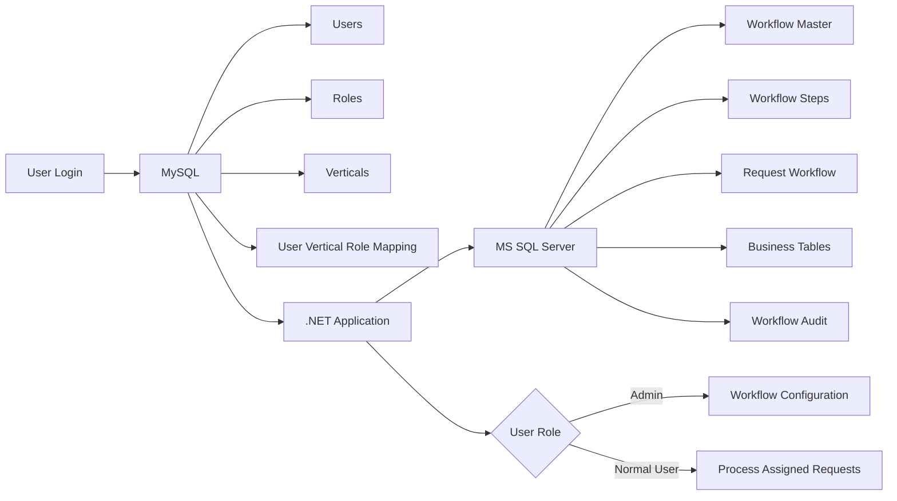
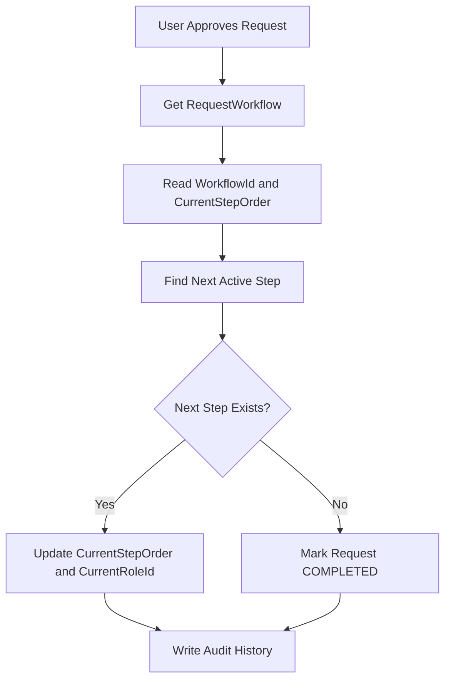
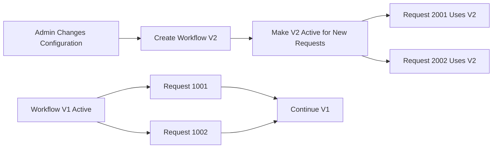
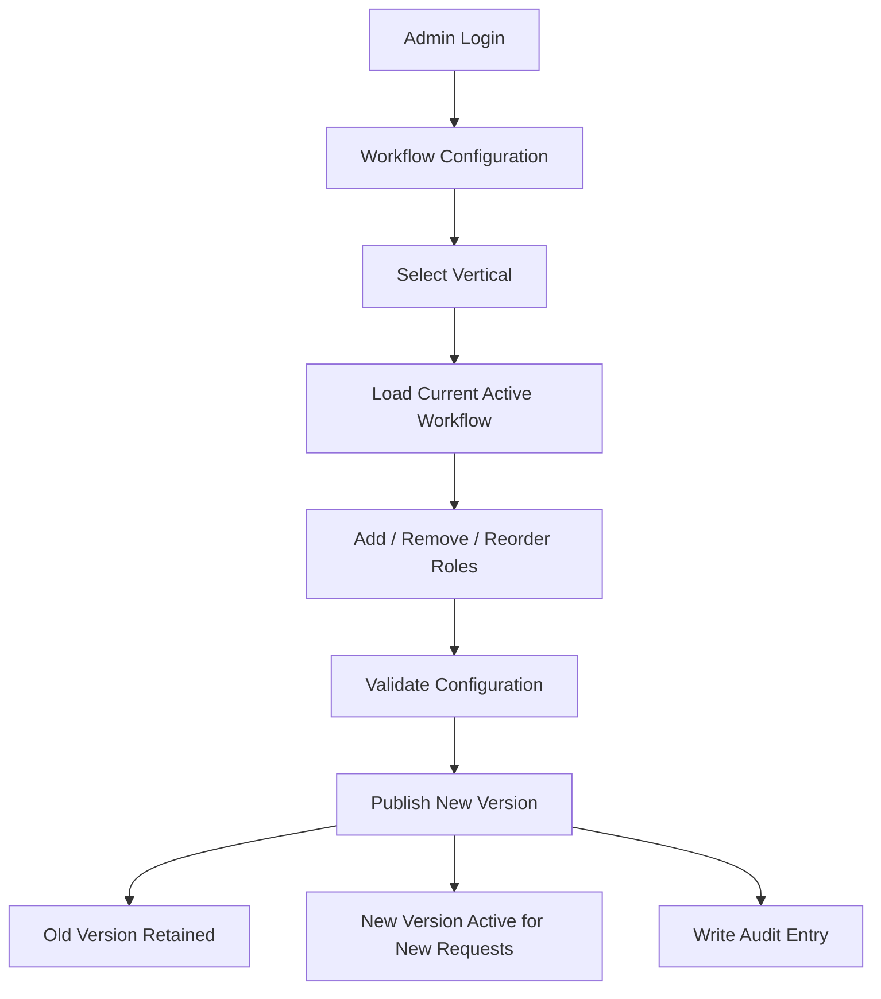

# Dynamic Approval Workflow Architecture

## 1. Objective

Build a fully dynamic, vertical-wise approval workflow inside the existing project without hardcoding role names, role numbers, approval order, or status values in JavaScript, C#, or stored procedures.

The system must support:

- Any number of roles.
- Any number of workflow steps.
- Different role sequences for different verticals.
- Nine or more verticals.
- Admin-only workflow configuration.
- Dynamic approve/reject routing.
- Safe role removal/deactivation.
- Workflow versioning so in-progress records are not broken when the flow changes.
- MySQL for identity/access data.
- Microsoft SQL Server for workflow and business processing.

---

## 2. Current Problem

The current implementation uses static role mapping and hardcoded workflow rules.

Example of the current anti-pattern:

```javascript
switch (role) {
    case "admin": return "1";
    case "verifier": return "2";
    case "auditor": return "3";
    case "accountant": return "4";
    case "hr": return "5";
}
```

The stored procedure also contains role-specific conditions and numeric statuses.

This creates several problems:

- Adding a role requires code changes.
- Removing a role can break the approval flow.
- Changing the sequence requires stored procedure changes.
- Different verticals cannot easily have different flows.
- Numeric values such as `1`, `2`, `3`, etc. become magic numbers.
- Existing in-progress records may become inconsistent if the workflow is changed.

---

## 3. Target Architecture



### Marathi Explanation

MySQL मध्ये user, role, vertical आणि user ला कोणत्या vertical मध्ये कोणता role आहे ही माहिती राहील.

MS SQL मध्ये actual workflow configuration, current request step, business processing आणि audit history राहील.

.NET application हे दोन्ही databases connect करेल. MySQL आणि MS SQL मध्ये direct cross-database join करण्याची गरज नाही.

---

## 4. Vertical-wise Dynamic Role Mapping

Every vertical can have its own independent workflow.

Example:

```text
Vertical 1 - Loan
Maker -> Verifier -> Manager

Vertical 2 - KYC
Maker -> Verifier -> Auditor -> Manager -> Admin

Vertical 3 - Audit
Auditor -> Admin

Vertical 4 - Finance
Maker -> Accountant -> CFO -> Admin
```

There is no rule that every vertical must have the same number of roles.

A vertical can have:

- 2 steps
- 3 steps
- 5 steps
- 10 steps
- or any other number of steps

The processing engine remains the same.

### Marathi Explanation

समजा आपल्याकडे 9 verticals आहेत. प्रत्येक vertical चा approval flow वेगळा असू शकतो.

एका vertical मध्ये 3 roles, दुसऱ्यात 5 roles आणि तिसऱ्यात फक्त 2 roles असले तरी काही problem नाही.

Main code common राहील. फक्त database configuration vertical-wise बदलेल.

---

## 5. Database Design

### 5.1 MySQL - Role Master

```sql
CREATE TABLE RoleMaster
(
    RoleId INT PRIMARY KEY AUTO_INCREMENT,
    RoleCode VARCHAR(50) NOT NULL UNIQUE,
    RoleName VARCHAR(100) NOT NULL,
    IsActive BIT NOT NULL DEFAULT 1
);
```

### 5.2 MySQL - Vertical Master

```sql
CREATE TABLE VerticalMaster
(
    VerticalId INT PRIMARY KEY AUTO_INCREMENT,
    VerticalCode VARCHAR(50) NOT NULL UNIQUE,
    VerticalName VARCHAR(100) NOT NULL,
    IsActive BIT NOT NULL DEFAULT 1
);
```

### 5.3 MySQL - User Vertical Role Mapping

```sql
CREATE TABLE UserVerticalRole
(
    Id BIGINT PRIMARY KEY AUTO_INCREMENT,
    UserId BIGINT NOT NULL,
    VerticalId INT NOT NULL,
    RoleId INT NOT NULL,
    IsActive BIT NOT NULL DEFAULT 1
);
```

This table allows the same user to have different roles in different verticals.

---

## 6. MS SQL - Workflow Tables

### 6.1 Workflow Master

```sql
CREATE TABLE WorkflowMaster
(
    WorkflowId INT IDENTITY(1,1) PRIMARY KEY,
    VerticalId INT NOT NULL,
    VersionNo INT NOT NULL,
    IsActive BIT NOT NULL DEFAULT 1,
    CreatedBy BIGINT NOT NULL,
    CreatedOn DATETIME2 NOT NULL DEFAULT SYSDATETIME()
);
```

### 6.2 Workflow Step

```sql
CREATE TABLE WorkflowStep
(
    WorkflowStepId INT IDENTITY(1,1) PRIMARY KEY,
    WorkflowId INT NOT NULL,
    RoleId INT NOT NULL,
    StepOrder INT NOT NULL,
    IsActive BIT NOT NULL DEFAULT 1,

    CONSTRAINT FK_WorkflowStep_WorkflowMaster
        FOREIGN KEY (WorkflowId)
        REFERENCES WorkflowMaster(WorkflowId),

    CONSTRAINT UQ_WorkflowStep_Order
        UNIQUE (WorkflowId, StepOrder)
);
```

Example data:

```text
WorkflowId | VerticalId | RoleId | StepOrder
------------------------------------------------
101        | 1          | 2      | 1
101        | 1          | 5      | 2
101        | 1          | 8      | 3

102        | 2          | 2      | 1
102        | 2          | 3      | 2
102        | 2          | 6      | 3
102        | 2          | 8      | 4
102        | 2          | 1      | 5
```

---

## 7. Request Workflow State

Every business request should remember which workflow/version it belongs to.

```sql
CREATE TABLE RequestWorkflow
(
    RequestWorkflowId BIGINT IDENTITY(1,1) PRIMARY KEY,
    RequestId BIGINT NOT NULL,
    VerticalId INT NOT NULL,
    WorkflowId INT NOT NULL,
    WorkflowVersion INT NOT NULL,
    CurrentStepOrder INT NOT NULL,
    CurrentRoleId INT NOT NULL,
    Status VARCHAR(30) NOT NULL,
    CreatedOn DATETIME2 NOT NULL DEFAULT SYSDATETIME(),
    UpdatedOn DATETIME2 NULL
);
```

Recommended statuses:

```text
PENDING
COMPLETED
REJECTED
CANCELLED
```

Do not use role-specific status numbers such as:

```text
1 = Verifier Pending
2 = Verifier Approved
3 = Verifier Rejected
4 = Accountant Approved
```

The combination of `CurrentStepOrder`, `CurrentRoleId`, and `Status` already describes the request state.

---

## 8. Dynamic Approve Flow

The stored procedure should not know that the next role is Manager, Auditor, Admin, etc.

It should only find the next active configured step.

```sql
SELECT TOP 1
    @NextStepOrder = StepOrder,
    @NextRoleId = RoleId
FROM WorkflowStep
WHERE WorkflowId = @WorkflowId
  AND StepOrder > @CurrentStepOrder
  AND IsActive = 1
ORDER BY StepOrder;
```

If no next step exists:

```sql
IF @NextStepOrder IS NULL
BEGIN
    UPDATE RequestWorkflow
    SET Status = 'COMPLETED',
        UpdatedOn = SYSDATETIME()
    WHERE RequestId = @RequestId;
END
```

### Flow Diagram



---

## 9. Dynamic Reject Flow

For a simple previous-step reject model:

```sql
SELECT TOP 1
    @NextStepOrder = StepOrder,
    @NextRoleId = RoleId
FROM WorkflowStep
WHERE WorkflowId = @WorkflowId
  AND StepOrder < @CurrentStepOrder
  AND IsActive = 1
ORDER BY StepOrder DESC;
```

This means the request automatically returns to the previous active step.

### Marathi Explanation

जर request Step 4 वर असेल आणि reject झाला तर query Step 4 पेक्षा लहान active step शोधेल.

उदा. Step 3 inactive असेल तर system Step 2 कडे जाऊ शकतो.

---

## 10. Where Do Stored Procedure Parameters Come From?

The UI should not send trusted workflow state such as `WorkflowId`, `CurrentStepOrder`, or `CurrentRoleId`.

The UI/API should mainly send:

```text
RequestId
Action
```

The stored procedure should fetch the authoritative workflow state from the database.

```sql
SELECT
    @WorkflowId = WorkflowId,
    @CurrentStepOrder = CurrentStepOrder,
    @CurrentRoleId = CurrentRoleId
FROM RequestWorkflow
WHERE RequestId = @RequestId;
```

This prevents a user from manipulating role IDs or step numbers from browser developer tools.

---

## 11. Role Removal

Do not physically delete a role that is being used in a workflow.

Use soft delete/deactivation:

```sql
UPDATE WorkflowStep
SET IsActive = 0
WHERE WorkflowStepId = @WorkflowStepId;
```

Before removing a role, check whether any requests are currently pending on that role.

```sql
SELECT COUNT(*)
FROM RequestWorkflow
WHERE CurrentRoleId = @RoleId
  AND Status = 'PENDING';
```

Recommended rule for the first implementation:

> If pending requests exist for the role, block role removal.

Later, an admin migration feature can move pending requests to another configured step.

---

## 12. Workflow Versioning

Workflow versioning protects in-progress records when an admin changes the flow.

Example:

```text
Workflow V1
Verifier -> Accountant -> HR
```

Some records are already processing in V1.

The admin changes the flow to:

```text
Workflow V2
Verifier -> Manager -> Auditor -> HR
```

Correct behavior:

```text
Old/In-Progress Requests -> Continue V1
New Requests             -> Use V2
```

Never overwrite the active workflow rows used by existing requests.

Create a new workflow version and mark it active for future requests.

### Versioning Diagram



---

## 13. Admin-only Configuration

Only authorized administrators should be able to configure workflows.

Security must exist at multiple levels.

### UI

Hide the menu for non-admin users.

```cshtml
@if (User.IsInRole("Admin"))
{
    <a asp-controller="WorkflowConfiguration"
       asp-action="Index">
        Workflow Configuration
    </a>
}
```

### Controller/API

```csharp
[Authorize(Roles = "Admin")]
public class WorkflowConfigurationController : Controller
{
    public IActionResult Index()
    {
        return View();
    }
}
```

Every create/update/publish endpoint must also be protected.

Do not trust a role value sent by JavaScript.

Use authenticated claims/session/server-side identity.

---

## 14. Admin Configuration Flow



For nine verticals, the admin can configure each vertical independently.

---

## 15. Workflow Audit

```sql
CREATE TABLE WorkflowAudit
(
    AuditId BIGINT IDENTITY(1,1) PRIMARY KEY,
    VerticalId INT NOT NULL,
    WorkflowId INT NOT NULL,
    OldVersion INT NULL,
    NewVersion INT NULL,
    ChangedBy BIGINT NOT NULL,
    Action VARCHAR(100) NOT NULL,
    ChangedOn DATETIME2 NOT NULL DEFAULT SYSDATETIME()
);
```

This provides answers to questions such as:

- Who changed the Finance workflow?
- When was Auditor added?
- Which workflow version processed a request?

---

## 16. Stored Procedure Refactoring Strategy

Do not rewrite the entire stored procedure unnecessarily.

Keep existing logic that is already stable, such as:

- Transaction handling
- TRY/CATCH
- Parameterized `sp_executesql`
- `QUOTENAME()` for trusted dynamic table names
- Existing business table update logic

Replace only the workflow decision logic:

```text
REMOVE:
Role-specific CASE statements
Role-name IF/ELSE conditions
Magic status numbers
Hardcoded next-role logic

ADD:
WorkflowId
CurrentStepOrder
NextStep lookup
Workflow version
Generic PENDING / COMPLETED state
```

### Before

```text
Role -> CASE/IF -> Numeric Status -> Hardcoded Next Role
```

### After

```text
RequestId
   -> RequestWorkflow
   -> WorkflowId
   -> CurrentStepOrder
   -> WorkflowStep
   -> Next Active Step
   -> Next Role
```

---

## 17. Recommended Implementation Order

1. Create workflow tables in MS SQL.
2. Seed current role sequences for all nine verticals.
3. Add request workflow tracking.
4. Refactor stored procedure workflow decision logic.
5. Remove JavaScript role-number switch mapping.
6. Read user-role-vertical access from MySQL.
7. Add Admin-only Workflow Configuration page.
8. Add workflow versioning.
9. Add audit logs.
10. Test all nine verticals.

---

## 18. Minimum Test Scenarios

- A vertical with 2 roles.
- A vertical with 3 roles.
- A vertical with 5 roles.
- Add a new role in the middle of the sequence.
- Reorder roles.
- Remove an unused role.
- Attempt to remove a role with pending requests.
- Approve until completion.
- Reject to previous active step.
- Change workflow while old requests are in progress.
- Verify old requests remain on old workflow version.
- Verify new requests use the latest workflow version.
- Verify a normal user cannot open configuration APIs.
- Verify Admin can publish a new workflow.

---

## 19. Final Result

After implementation, the system should behave like this:

```text
Vertical A
Role A -> Role B -> Role C

Vertical B
Role X -> Role Y

Vertical C
Role P -> Role Q -> Role R -> Role S -> Role T

             |
             v
       SAME GENERIC ENGINE
```

No role name, role number, vertical flow, or sequence should be hardcoded in JavaScript, C#, or stored procedures.

The workflow must be controlled by configuration data, protected by Admin authorization, versioned for safe changes, and auditable for production support.
