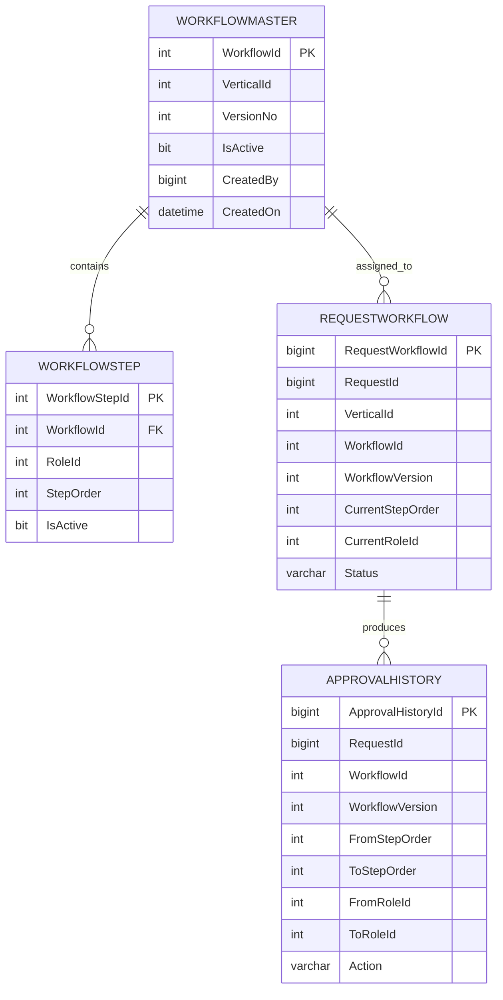

# Dynamic Approval Workflow - Table Columns and Purpose

> This document explains exactly which columns are required in each table, why each column exists, and how the tables relate to each other.

---

## 1. High-Level Architecture

```text
MYSQL
 ├── User
 ├── RoleMaster
 ├── VerticalMaster
 └── UserVerticalRole

              .NET Application
                    |
                    v

MS SQL
 ├── WorkflowMaster
 │      |
 │      └── WorkflowStep
 │
 ├── RequestWorkflow
 │      |
 │      └── ApprovalHistory
 │
 ├── Business Tables
 │
 └── WorkflowAudit
```

### Marathi explanation

MySQL मध्ये user, role, vertical आणि user ला कोणत्या vertical मध्ये कोणता role आहे ही माहिती राहील.
MS SQL मध्ये workflow configuration, request ची current workflow state, business data आणि audit/history राहील.

---

## 2. UserVerticalRole - MySQL

This table maps a user to a vertical and a role.
The same user can have different roles in different verticals.

```sql
CREATE TABLE UserVerticalRole
(
    Id BIGINT PRIMARY KEY AUTO_INCREMENT,
    UserId BIGINT NOT NULL,
    VerticalId INT NOT NULL,
    RoleId INT NOT NULL,
    IsActive BIT NOT NULL DEFAULT 1
);
```

### Column purpose

| Column | Purpose |
|---|---|
| Id | Primary key for the mapping row |
| UserId | Identifies the user |
| VerticalId | Identifies the vertical |
| RoleId | Role assigned to the user for that vertical |
| IsActive | Soft enable/disable of this mapping |

### Example

```text
UserId | VerticalId | RoleId
-----------------------------
101    | 1          | 2
101    | 3          | 5
101    | 7          | 4
```

Meaning:

```text
User 101
Vertical 1 -> Role 2
Vertical 3 -> Role 5
Vertical 7 -> Role 4
```

---

## 3. WorkflowMaster - MS SQL

This table represents one published workflow version for one vertical.

```sql
CREATE TABLE WorkflowMaster
(
    WorkflowId INT IDENTITY(1,1) PRIMARY KEY,
    VerticalId INT NOT NULL,
    VersionNo INT NOT NULL,
    IsActive BIT NOT NULL DEFAULT 1,
    CreatedBy BIGINT NOT NULL,
    CreatedOn DATETIME2 NOT NULL DEFAULT SYSDATETIME(),
    PublishedOn DATETIME2 NULL
);
```

### Column purpose

| Column | Purpose |
|---|---|
| WorkflowId | Unique ID of this workflow version |
| VerticalId | Vertical to which this workflow belongs |
| VersionNo | Version number such as 1, 2, 3 |
| IsActive | Whether this version should be used for NEW requests |
| CreatedBy | Admin user who created/published it |
| CreatedOn | When it was created |
| PublishedOn | When it became active/published |

### Example

```text
WorkflowId | VerticalId | VersionNo | IsActive
------------------------------------------------
101        | 4          | 1         | 0
102        | 4          | 2         | 1
```

Meaning:

```text
Finance V1 -> old version
Finance V2 -> active version for new requests
```

Important:

`IsActive = 0` does not mean old requests cannot use the version.
It only means new requests should not be assigned to that version.

---

## 4. WorkflowStep - MS SQL

This table stores the actual ordered role sequence for one workflow version.

```sql
CREATE TABLE WorkflowStep
(
    WorkflowStepId INT IDENTITY(1,1) PRIMARY KEY,
    WorkflowId INT NOT NULL,
    RoleId INT NOT NULL,
    StepOrder INT NOT NULL,
    IsActive BIT NOT NULL DEFAULT 1,

    CONSTRAINT FK_WorkflowStep_WorkflowMaster
        FOREIGN KEY (WorkflowId)
        REFERENCES WorkflowMaster(WorkflowId),

    CONSTRAINT UQ_WorkflowStep_Order
        UNIQUE (WorkflowId, StepOrder)
);
```

### Column purpose

| Column | Purpose |
|---|---|
| WorkflowStepId | Unique ID of the workflow step |
| WorkflowId | Parent workflow version |
| RoleId | Role responsible for this step |
| StepOrder | Position in the workflow sequence |
| IsActive | Whether this step is active in this version |

### Example

```text
WorkflowId | RoleId | StepOrder
---------------------------------
102        | 2      | 1
102        | 5      | 2
102        | 8      | 3
```

Meaning:

```text
Step 1 -> Role 2
Step 2 -> Role 5
Step 3 -> Role 8
```

Important:

RoleId is identity, not sequence.
Do not assume RoleId 2 means Step 2.
Do not assume a specific role is always last.
The StepOrder controls the flow.

---

## 5. RequestWorkflow - MS SQL

This is the main runtime workflow-state table.
Each business request gets one workflow-state row.

```sql
CREATE TABLE RequestWorkflow
(
    RequestWorkflowId BIGINT IDENTITY(1,1) PRIMARY KEY,
    RequestId BIGINT NOT NULL,
    VerticalId INT NOT NULL,
    WorkflowId INT NOT NULL,
    WorkflowVersion INT NOT NULL,
    CurrentStepOrder INT NOT NULL,
    CurrentRoleId INT NOT NULL,
    Status VARCHAR(30) NOT NULL,
    CreatedOn DATETIME2 NOT NULL DEFAULT SYSDATETIME(),
    UpdatedOn DATETIME2 NULL
);
```

### Column purpose

| Column | Purpose |
|---|---|
| RequestWorkflowId | Primary key of workflow-state row |
| RequestId | Business request identifier |
| VerticalId | Vertical of the request |
| WorkflowId | Exact workflow version assigned to the request |
| WorkflowVersion | Version number for reporting/debugging |
| CurrentStepOrder | Current step position |
| CurrentRoleId | Role that currently owns the request |
| Status | PENDING / COMPLETED / CANCELLED / etc. |
| CreatedOn | When workflow processing started |
| UpdatedOn | Last workflow movement timestamp |

### Example

```text
RequestId        = 5001
VerticalId       = 4
WorkflowId       = 102
WorkflowVersion  = 2
CurrentStepOrder = 2
CurrentRoleId    = 5
Status           = PENDING
```

Meaning:

```text
Request 5001 belongs to Finance workflow V2.
It is currently at Step 2.
Role 5 currently owns it.
```

### Why this table is important

The generic query gets these values from RequestWorkflow:

```text
@WorkflowId
@WorkflowVersion
@CurrentStepOrder
@CurrentRoleId
@VerticalId
```

Example:

```sql
SELECT
    @WorkflowId = WorkflowId,
    @WorkflowVersion = WorkflowVersion,
    @CurrentStepOrder = CurrentStepOrder,
    @CurrentRoleId = CurrentRoleId,
    @VerticalId = VerticalId
FROM RequestWorkflow
WHERE RequestId = @RequestId;
```

---

## 6. ApprovalHistory - MS SQL

This table stores actual request movement history.
It is different from WorkflowAudit.

```sql
CREATE TABLE ApprovalHistory
(
    ApprovalHistoryId BIGINT IDENTITY(1,1) PRIMARY KEY,
    RequestId BIGINT NOT NULL,
    WorkflowId INT NOT NULL,
    WorkflowVersion INT NOT NULL,
    FromStepOrder INT NULL,
    ToStepOrder INT NULL,
    FromRoleId INT NULL,
    ToRoleId INT NULL,
    Action VARCHAR(30) NOT NULL,
    PerformedBy BIGINT NOT NULL,
    Remarks NVARCHAR(1000) NULL,
    PerformedOn DATETIME2 NOT NULL DEFAULT SYSDATETIME()
);
```

### Column purpose

| Column | Purpose |
|---|---|
| ApprovalHistoryId | Unique history row ID |
| RequestId | Business request that moved |
| WorkflowId | Workflow version used |
| WorkflowVersion | Workflow version number |
| FromStepOrder | Previous step |
| ToStepOrder | Destination step |
| FromRoleId | Previous role |
| ToRoleId | Destination role |
| Action | APPROVE / REJECT / CREATED / COMPLETED / etc. |
| PerformedBy | User who performed the action |
| Remarks | Optional comment |
| PerformedOn | When action happened |

### Example

```text
Request 5001
FromRole = Verifier
ToRole = Manager
Action = APPROVE
```

Later:

```text
Request 5001
FromRole = Manager
ToRole = Verifier
Action = REJECT
```

This table gives complete operational approval history.

---

## 7. WorkflowAudit - MS SQL

This table stores workflow CONFIGURATION changes made by Admin.
It does not store request approval movement.

```sql
CREATE TABLE WorkflowAudit
(
    AuditId BIGINT IDENTITY(1,1) PRIMARY KEY,
    VerticalId INT NOT NULL,
    OldWorkflowId INT NULL,
    NewWorkflowId INT NULL,
    OldVersion INT NULL,
    NewVersion INT NULL,
    ChangedBy BIGINT NOT NULL,
    Action VARCHAR(100) NOT NULL,
    ChangedOn DATETIME2 NOT NULL DEFAULT SYSDATETIME()
);
```

### Column purpose

| Column | Purpose |
|---|---|
| AuditId | Unique audit row ID |
| VerticalId | Vertical whose workflow changed |
| OldWorkflowId | Previous workflow version ID |
| NewWorkflowId | Newly published workflow version ID |
| OldVersion | Previous version number |
| NewVersion | New version number |
| ChangedBy | Admin user who made the change |
| Action | Example: Workflow Published / Role Added / Role Removed |
| ChangedOn | Timestamp of configuration change |

### Example

```text
Vertical = Finance
OldVersion = 1
NewVersion = 2
ChangedBy = Admin 1001
Action = Workflow Published
```

---

## 8. Business Tables - MS SQL

Existing business tables can remain as they are where possible.
Do not duplicate workflow configuration columns into every business table unless absolutely required.
Use RequestId to connect the business record with RequestWorkflow.

Example relationship:

```text
BusinessTable.RequestId
        |
        v
RequestWorkflow.RequestId
```

The existing stored procedure can continue updating business tables.
The main refactor should be around workflow decision logic.

---

## 9. Table Relationships

```text
Vertical
   |
   v
WorkflowMaster
   |
   v
WorkflowStep

Business Request
   |
   v
RequestWorkflow
   |
   +---- WorkflowId ----> WorkflowMaster
   |
   +---- CurrentStep ---> WorkflowStep
   |
   v
ApprovalHistory

Admin Workflow Changes
   |
   v
WorkflowAudit
```

### Mermaid diagram



---

## 10. Generic Query Parameter Source

The API/UI should preferably send:

```text
RequestId
Action
Remarks
```

The DB then loads:

```text
@WorkflowId
@WorkflowVersion
@CurrentStepOrder
@CurrentRoleId
@VerticalId
```

from RequestWorkflow.

Then the generic next-step query produces:

```text
@NextStepOrder
@NextRoleId
```

### Full flow

```text
UI/API
  |
  | RequestId + Action
  v
RequestWorkflow
  |
  | WorkflowId + CurrentStep + CurrentRole + Vertical
  v
WorkflowStep
  |
  | Generic query
  v
NextStepOrder + NextRoleId
```

---

## 11. TL Notebook Summary

```text
MYSQL
----
User
RoleMaster
VerticalMaster
UserVerticalRole

MS SQL
------
WorkflowMaster
WorkflowStep
RequestWorkflow
ApprovalHistory
WorkflowAudit
Business Tables

WorkflowMaster
= One published workflow version per vertical

WorkflowStep
= Role sequence of that workflow version

RequestWorkflow
= Current runtime state of one business request

ApprovalHistory
= Approve/Reject movement history of requests

WorkflowAudit
= Admin configuration-change history
```

### Marathi explanation for TL

```text
WorkflowMaster मध्ये vertical चा version राहतो.
WorkflowStep मध्ये त्या version चा role sequence राहतो.
RequestWorkflow मध्ये request सध्या कुठल्या step वर आहे ते राहते.
ApprovalHistory मध्ये request कुठून कुठे move झाला ते राहते.
WorkflowAudit मध्ये Admin ने configuration कधी बदलली ते राहते.
```
